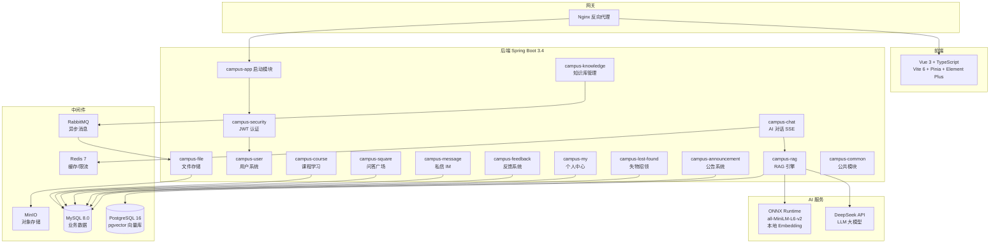

# 校圈 CampusHub — 基于 RAG 的 AI 智能校园综合平台

[](https://openjdk.org/)
[](https://spring.io/)
[](https://vuejs.org/)
[](LICENSE)
[]()

## 架构图



## 技术栈

| 层级 | 技术 | 版本 |
|------|------|------|
| 前端框架 | Vue 3 + TypeScript + Vite 6 | 3.5 / 6.x |
| UI 组件库 | Element Plus | 2.x |
| 状态管理 | Pinia | 2.x |
| 后端框架 | Spring Boot | 3.4.5 |
| 安全认证 | Spring Security 6 + JWT (JJWT) | 6.x / 0.12 |
| ORM | MyBatis Plus | 3.5.9 |
| AI 框架 | LangChain4j | 1.0.0-beta1 |
| LLM | DeepSeek Chat (OpenAI 兼容) | — |
| 嵌入模型 | all-MiniLM-L6-v2 (384维) | ONNX 本地 |
| 向量数据库 | PostgreSQL 16 + pgvector | 16 |
| 业务数据库 | MySQL | 8.0 |
| 缓存/限流 | Redis + Redisson | 7 / 3.40 |
| 消息队列 | RabbitMQ | 3-management |
| 对象存储 | MinIO | latest |
| 容器化 | Docker Compose + Nginx | — |
| 测试 | JUnit 5 + Mockito + AssertJ | 5.x / 5.x |
| API 文档 | Knife4j (Swagger 3) | 4.5 |

## 模块结构（14 模块）

```
campus-server/
├── campus-common/        # 公共：BaseEntity, R<T>, ResultCode, UserContext
├── campus-security/      # 认证：JWT 生成/验证/过滤器, LoginUser
├── campus-user/          # 用户：登录/注册/个人信息/账号锁定
├── campus-chat/          # AI 对话：SSE 流式, 20条多轮上下文记忆
├── campus-rag/           # RAG 引擎：Embedding/检索/Prompt 组装
├── campus-knowledge/     # 知识库：文档上传, RabbitMQ 异步解析
├── campus-course/        # 课程学习：视频/章节/评论/点赞/收藏
├── campus-square/        # 问答广场：公开发布/浏览/点赞/全文搜索
├── campus-message/       # 私信 IM：会话式私信, 文本/图片
├── campus-feedback/      # 反馈：消息点赞/踩, 统计, 双重编码防注入
├── campus-my/            # 个人中心：我的点赞/收藏聚合查询
├── campus-lost-found/    # 失物招领：发布/查找/管理
├── campus-announcement/  # 公告：CRUD/轮播/附件, 6种分类
├── campus-file/          # 文件：MinIO 上传/下载/预览
└── campus-app/           # 启动：SpringBoot 主类, 全局配置
```

## 核心功能

| 功能 | 技术亮点 |
|------|----------|
| **RAG AI 对话** | Document→Split→Embed→Retrieve→Prompt→Generate 完整 Pipeline |
| **SSE 流式输出** | Spring SseEmitter, 前端 AbortController 停止生成 |
| **混合检索** | pgvector 余弦相似度 + 关键词检索, top_k=5 |
| **多轮对话** | 最近 20 条消息 (10 轮) 上下文窗口 |
| **文档知识库** | PDF/Word/MD/TXT 自动向量化, RabbitMQ 异步处理 |
| **课程学习** | 视频播放、章节大纲、评论树、点赞收藏 |
| **问答广场** | 公开问答、全文搜索 (MySQL ngram)、点赞 |
| **私信 IM** | 会话式私信、文本/图片、未读计数 |
| **反馈系统** | Like/Dislike toggle、统计聚合、防重复 |
| **个人中心** | 跨模块点赞/收藏聚合 (课程+帖子+评论) |
| **JWT 双 Token** | Access 30min + Refresh 7d, 自动续期 |
| **限流保护** | Redisson RateLimiter, AOP 注解式声明 |
| **API 文档** | Knife4j 自动生成, /doc.html 在线调试 |

## 快速开始

### 1. 启动中间件

```bash
cd docker
docker-compose up -d mysql postgres redis rabbitmq minio
```

### 2. 设置 API Key

```bash
# Windows PowerShell
$env:DEEPSEEK_API_KEY = "sk-your-key"

# macOS / Linux
export DEEPSEEK_API_KEY=sk-your-key
```

### 3. 启动后端

```bash
cd campus-server
mvn clean install -DskipTests
cd campus-app
mvn spring-boot:run
```

### 4. 启动前端

```bash
cd campus-web
npm install
npm run dev
```

### 5. 运行测试

```bash
cd campus-server
mvn test -pl campus-course,campus-feedback,campus-security
```

### 访问地址

| 服务 | 地址 |
|------|------|
| 前端页面 | http://localhost:5173 |
| API 文档 | http://localhost:8080/doc.html |
| RabbitMQ | http://localhost:15672 (guest/guest) |
| MinIO | http://localhost:9001 (minioadmin/minioadmin) |
| MySQL | localhost:3306 (root/root) |
| Redis | localhost:6379 |

### 初始账号

- 管理员: `admin` / `admin123`
- 角色: ADMIN / TEACHER / STUDENT

## 面试问答参考

### Q: 为什么用 LangChain4j 而不是 Python LangChain？
**A:** Java 生态原生集成，无需跨语言调用。Spring Boot 深度整合，部署运维成本低。国内企业 Java 仍是主力。

### Q: RAG 检索精度如何保证？
**A:** 混合检索策略——pgvector 余弦相似度做语义匹配 + MySQL FULLTEXT 做关键词兜底。chunk_size=500 控制上下文精度，overlap=50 防止边界信息丢失。

### Q: 为什么用 SSE 而不是 WebSocket？
**A:** AI 对话是单向流式推送（服务端→客户端），SSE 比 WebSocket 更轻量，无需心跳保活，浏览器原生支持和自动重连。

### Q: 你怎么处理并发竞态？
**A:** 课程浏览量使用 `setSql("view_count = view_count + 1")` 原子更新；点赞/收藏通过 `UNIQUE INDEX(user_id, target_id)` + `INSERT/DELETE` toggle 模式保证幂等。

### Q: 项目有哪些测试？
**A:** 25 个单元测试覆盖核心逻辑（JUnit 5 + Mockito），包括 JWT 生成/验证、反馈 toggle/统计、课程 CRUD/点赞/收藏/评论。

## License

MIT
