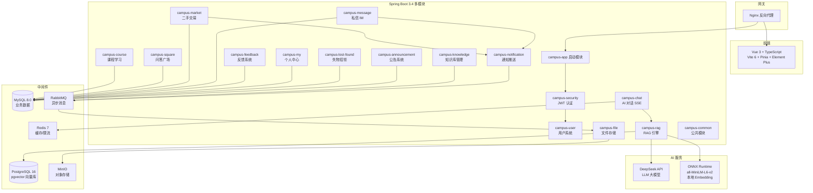

# 校圈 CampusHub — 基于 RAG 的 AI 校园综合平台

[](https://openjdk.org/)
[](https://spring.io/)
[](https://vuejs.org/)
[](LICENSE)
[]()

> 一个全栈校园综合服务平台，集成 RAG 智能问答、课程学习、二手交易、私信 IM、通知推送等功能。
> 适合作为 **Java 后端实习/校招项目**展示。

## 架构图



## 技术栈

| 层级 | 技术 | 说明 |
|------|------|------|
| 前端 | Vue 3 + TypeScript + Vite 6 + Pinia + Element Plus | SPA 单页应用 |
| 后端 | Spring Boot 3.4.5 + MyBatis Plus 3.5.9 | 17 模块 Maven 多模块 |
| 安全 | Spring Security 6 + JWT (JJWT 0.12) | 双 Token：Access 30min / Refresh 7d |
| AI | LangChain4j 1.0.0-beta1 + DeepSeek Chat | OpenAI 兼容适配 |
| 嵌入 | all-MiniLM-L6-v2 (384维) | ONNX Runtime 本地运行 |
| 向量库 | PostgreSQL 16 + pgvector | 余弦相似度检索 |
| 业务库 | MySQL 8.0 | InnoDB + ngram 全文索引 |
| 缓存 | Redis 7 + Spring Cache | @Cacheable 声明式缓存 |
| 限流 | Redisson 3.40.2 RRateLimiter | AOP 注解式限流 |
| 消息队列 | RabbitMQ 3 | 文档异步解析 + 通知异步分发 |
| 实时通信 | WebSocket | 私信推送 + 通知推送 |
| 对象存储 | MinIO | 图片/视频/文档存储 |
| API 文档 | Knife4j (SpringDoc OpenAPI) | /doc.html 在线调试 |
| 测试 | JUnit 5 + Mockito + AssertJ + MockMvc | 56 个测试全部通过 |
| 部署 | Docker Compose + Nginx | 一键启动 5 个中间件 |

## 模块结构（17 模块）

```
campus-server/
├── campus-common/         # 公共：BaseEntity, R<T>, ResultCode, UserContext,
│                          #   @RateLimit 限流注解, TraceIdFilter, 全局异常处理
├── campus-security/       # 认证：JWT 生成/验证/过滤器, LoginUser, SecurityConfig
├── campus-user/           # 用户：登录/注册/个人信息, 登录失败锁定(Redis)
├── campus-chat/           # AI 对话：SSE 流式输出, 20条多轮上下文, @RateLimit 限流
├── campus-rag/            # RAG 引擎：EmbeddingService, RetrieverService, RagService
├── campus-knowledge/      # 知识库：文档上传, RabbitMQ 异步向量化解析
├── campus-course/         # 课程：视频播放, 章节管理, 评论树, 点赞/收藏
├── campus-square/         # 广场：公开问答, 全文搜索(ngram), 点赞/收藏
├── campus-market/         # 二手交易：商品发布, 分类筛选, 评论树, 出价系统
├── campus-message/        # 私信：会话式 IM, WebSocket 实时推送, 未读计数
├── campus-notification/   # 通知：RabbitMQ 异步生成, WebSocket 实时推送
├── campus-feedback/       # 反馈：消息点赞/踩 toggle, 去重统计
├── campus-my/             # 个人中心：跨模块点赞/收藏聚合查询
├── campus-lost-found/     # 失物招领：发布/查找/管理, 状态跟踪
├── campus-announcement/   # 公告：CRUD/轮播/附件上传, 6种分类
├── campus-file/           # 文件：MinIO 上传/下载, 图片/视频/文档存储
└── campus-app/            # 启动：CampusApplication, 全局配置, 数据初始化
```

## 核心功能与面试亮点

| 功能 | 技术实现 | 面试价值 |
|------|----------|----------|
| **RAG AI 对话** | Document→Split→Embed→Retrieve→Augment→Generate 完整 Pipeline | 展示 AI 工程能力 |
| **SSE 流式输出** | SseEmitter + AbortController 可中断生成 | 理解 HTTP 流式协议 |
| **混合检索** | pgvector 余弦相似度 + FULLTEXT ngram 兜底 | 向量数据库实战 |
| **多轮对话** | 20 条消息(10轮)上下文窗口, 按会话隔离 | Token 窗口管理 |
| **二手交易** | CRUD + 评论树 + 出价/接受/拒绝工作流 + 通知 | 复杂业务建模 |
| **通知系统** | RabbitMQ 异步 + WebSocket 实时 + 离线拉取兜底 | 消息队列实战 |
| **WebSocket** | 私信实时推送 + 通知推送, 3秒自动重连 | 实时通信方案 |
| **限流保护** | Redisson RRateLimiter + AOP @RateLimit 注解 | 高并发防护 |
| **声明式缓存** | Spring Cache + Redis, 按区域配置不同 TTL | 缓存策略设计 |
| **结构化日志** | Logback MDC traceId, JSON 文件输出支持 ELK | 可观测性 |
| **请求追踪** | TraceIdFilter 注入全局 traceId, 异常响应带回 | 排障效率 |
| **JWT 安全** | Access 30min + Refresh 7d, BCrypt 密码加密 | 认证鉴权方案 |
| **SQL 优化** | 复合索引覆盖高频查询, FULLTEXT 中文分词 | 数据库调优 |
| **测试体系** | JUnit 5 + Mockito + AssertJ + MockMvc, 56 tests | 代码质量意识 |
| **CI/CD** | GitHub Actions 自动编译/测试/构建 | DevOps 能力 |

## 快速开始

### 1. 一键启动中间件

```bash
# Windows
docker\start.bat

# macOS / Linux
cd docker && docker-compose up -d mysql postgres redis rabbitmq minio
```

### 2. 设置 API Key

```bash
# Windows PowerShell
$env:DEEPSEEK_API_KEY = "sk-your-key"

# macOS / Linux
export DEEPSEEK_API_KEY=sk-your-key
```

### 3. 启动后端

```bash
cd campus-server
mvn clean install -DskipTests
cd campus-app
mvn spring-boot:run
```

### 4. 启动前端

```bash
cd campus-web
npm install
npm run dev
```

### 5. 运行测试

```bash
cd campus-server

# 全部测试
mvn test

# 指定模块
mvn test -pl campus-market,campus-notification
```

### 访问地址

| 服务 | 地址 | 凭证 |
|------|------|------|
| 前端 | http://localhost:5173 | — |
| API 文档 | http://localhost:8080/doc.html | — |
| RabbitMQ 控制台 | http://localhost:15672 | guest/guest |
| MinIO 控制台 | http://localhost:9001 | minioadmin/minioadmin |

### 初始账号

- **管理员**：`admin` / `admin123`
- 普通用户可通过注册页面创建

## 面试问答

### Q: 为什么选 LangChain4j 而不是 Python LangChain？
**A:** Java 生态原生集成，无需跨语言调用。Spring Boot 深度整合，国内企业 Java 后端仍是主力。LangChain4j 提供 ChatModel、EmbeddingStore、Retriever 等与 Python 版对等的抽象。

### Q: RAG 检索精度怎么保证？
**A:** 混合检索策略——pgvector 余弦相似度做语义匹配，MySQL FULLTEXT ngram 做中文关键词兜底。chunk_size=500 控制上下文粒度，overlap=50 防止边界截断。检索结果与用户问题拼接为 Prompt 注入 LLM。

### Q: 为什么 AI 对话用 SSE 而不是 WebSocket？
**A:** AI 流式输出是单向推送（服务端→客户端），SSE 比 WebSocket 更轻：无需心跳保活、浏览器原生 `EventSource` 自动重连、HTTP/2 多路复用。项目中私信和通知才用 WebSocket，因为需要双向通信。

### Q: 怎么处理并发竞态？
**A:** 三层防护：① 浏览量使用 `SET view_count = view_count + 1` MySQL 原子更新；② 点赞/收藏通过 `UNIQUE INDEX(user_id, target_id)` + toggle 模式保证幂等；③ 出价接受时拒绝同一商品其他待处理出价（DB 行锁 + 事务）。

### Q: 消息队列怎么用的？
**A:** 两个场景：① 文档上传后 RabbitMQ 异步向量化解析（避免阻塞用户请求）；② 通知系统通过 RabbitMQ 解耦——业务模块发消息到 `notification.queue`，通知模块消费后 WebSocket 推送给用户。失败不影响主流程。

### Q: 缓存策略是什么？
**A:** Spring Cache + Redis，按数据特性配置不同 TTL：课程列表 5 分钟、热门帖子 10 分钟、公告轮播 10 分钟、二手列表 3 分钟。写操作通过 `@CacheEvict` 主动失效。Redisson 还用于 API 限流（`@RateLimit` 注解）。

### Q: 项目测试情况？
**A:** 56 个测试覆盖 5 个模块：JWT 认证(6)、课程服务(12)、反馈服务(7)、二手交易(17)、通知服务(7)、API 集成(7)。使用 JUnit 5 @Nested 分组、Mockito 单元测试、MockMvc 集成测试、AssertJ 流式断言。

### Q: 模块是怎么拆分的？
**A:** 按业务领域垂直拆分 17 个 Maven 模块，共享 `campus-common`（BaseEntity、全局异常处理、限流切面、TraceIdFilter）。模块间通过 Maven 依赖 + Spring Bean 注入通信，避免循环依赖。

### Q: 项目还有哪些可以改进的？
**A:** ① 引入 Spring Cloud 微服务化（但当前模块化已做到解耦）；② 添加 Prometheus + Grafana 监控；③ Elasticsearch 替代 MySQL FULLTEXT 提升搜索体验；④ 前端增加骨架屏和离线 PWA 支持。

## License

MIT
